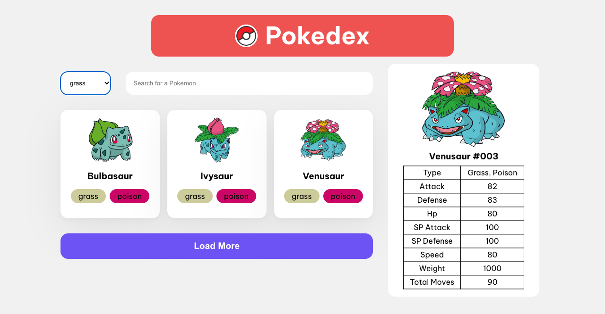
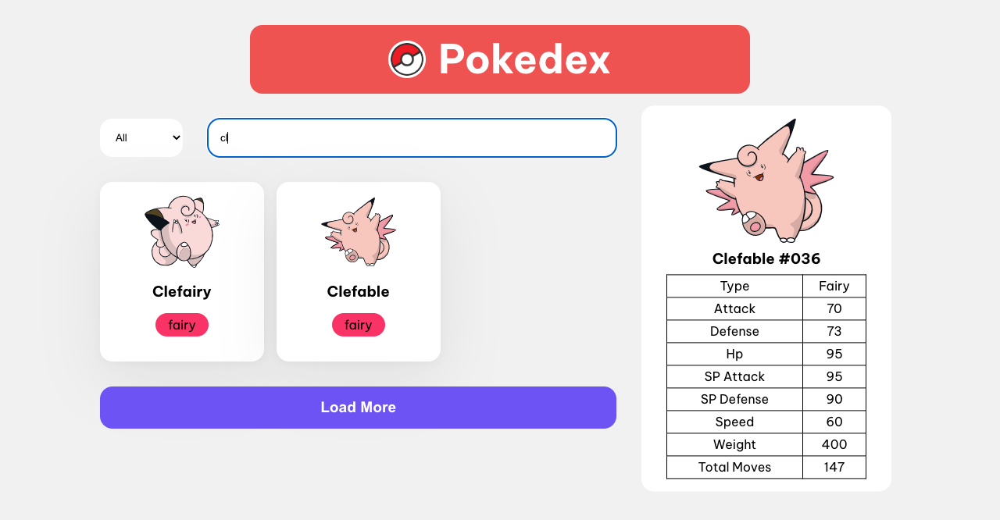
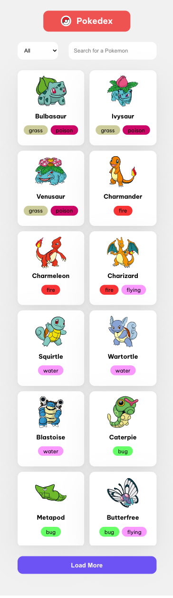
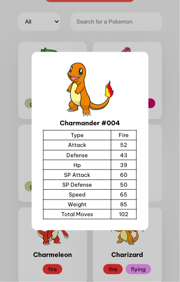
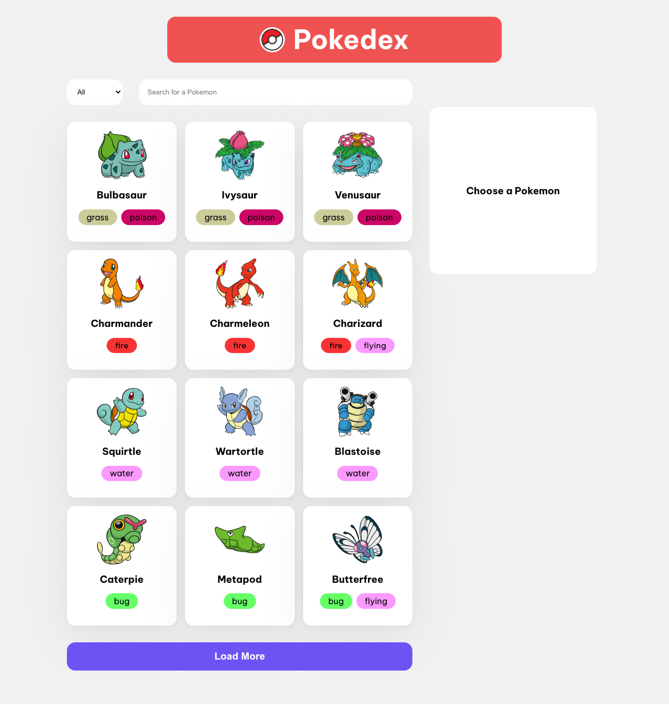

# Hi there!

This is **Pokedex app**.

It is used for searching for different pokemons and their specifications. It is compatible with Desktops and Mobiles. Some main features are pokemons cards each with pokemon's type, pokemon's specification, select pokemons by type, search pokemons by name.

Let me tell you more about project features.

## Technologies I used in this project:

- React (TypeScript)

  Main JavaScript framework

- Context API

  It is used for storing chose pokemon and its' component state (open, close)

- Styled-Components + sass

  It is a library for styling.

- axios

  It is used for making RESTapi requests

## Main features in detail

### Select Pokemons by Type

There are 20 types of pokemons in [Pokeapi.co](https://pokeapi.co/). You can search for pokemons with specific type.

Types :

1. Normal
2. Fighting
3. Flying
4. Poison
5. Ground
6. Rock
7. Bug
8. Ghost
9. Steel
10. Fire
11. Water
12. Grass
13. Electric
14. Psychic
15. Ice
16. Dragon
17. Dark
18. Fairy
19. Unknown
20. Shadow

### Search Pokemons by Name

You can also search for pokemons by their names!

### Mobile compatibility

The Pokedex is compatible with Mobiles. So you can search for pokemons directly from your phone.

_Mobile preview_

_Chose Pokemon on Mobile_

_Desktop preview_

